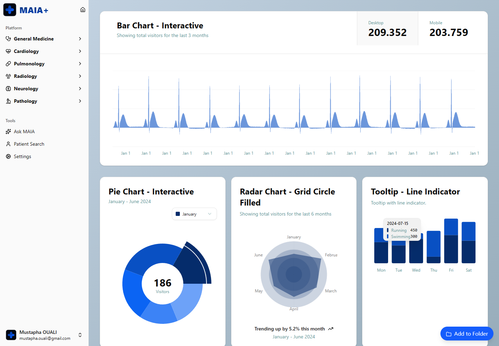

<h1 style="font-family: Arial, sans-serif; font-size: 36px; color: #5FA8F5; display: flex; align-items: center; gap: 12px; border-bottom: 3px solid #5FA8F5; padding-bottom: 8px;">
  
  GAIA - AI4HEALTH Desktop Platform
</h1>

GAIA (AI4HEALTH) is a desktop-first health-tech project built with **Tauri + React + TypeScript + Vite**.
It combines a modern frontend with native desktop packaging for fast local workflows.

---

## Screenshot

<p align="center">
  
</p>

---

## Tech Used


---

## Project Structure

```text
src/                 # React UI
src-tauri/           # Tauri + Rust app shell
```

---

## Status

The frontend is the developed half of this hackathon build: a full routed dashboard shell exists for cardiology, neurology, pathology, pulmonology, radiology, general medicine, and monitoring, with real ECG/EEG-style charting (Recharts) and Google Gemini (`@google/genai`) integration for AI-assisted features.

The bundled `server/app.py` Flask backend, however, is only a two-route "Hello, World!" stub (`/` and `/hello/<name>`) — it has no real endpoints and isn't wired into the frontend. Any data shown in the dashboards is frontend-side (mocked or client-side generated), not served by a real backend.

---

## Getting Started

```bash
pnpm install
pnpm tauri dev
```

Frontend-only dev mode:

```bash
pnpm dev
```

---

## Available Scripts

```bash
pnpm start      # tauri dev
pnpm dev        # vite dev server
pnpm build      # frontend build
pnpm preview    # preview frontend build
pnpm tauri      # tauri CLI
```
